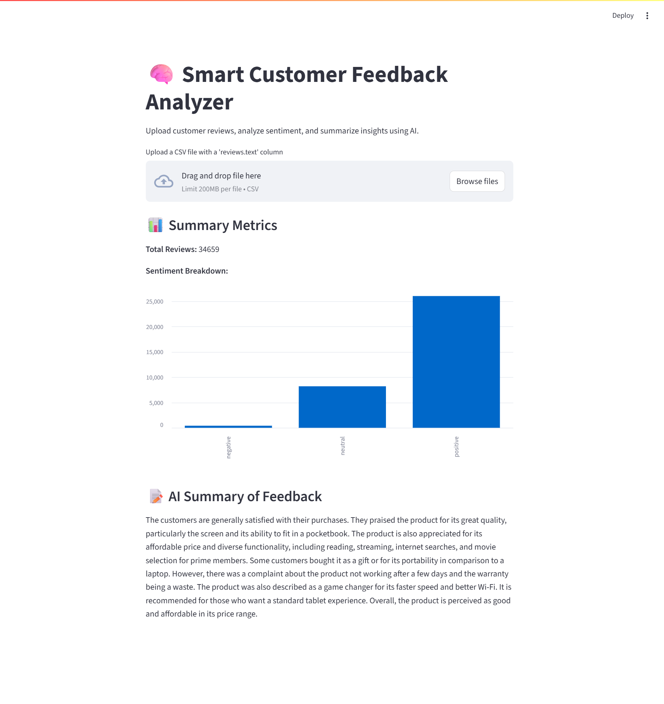

# 🧠 Smart Customer Feedback Analyzer

A data analytics + AI automation project that collects, analyzes, and summarizes customer reviews using sentiment analysis and GPT-4.

---

## 🚀 Features

- 📥 Load customer reviews (demo CSV included)
- 🧹 Clean and preprocess text data
- 📊 Analyze sentiment using NLP (TextBlob)
- 🤖 Summarize reviews with OpenAI GPT-4
- 📈 Visualize insights in a Streamlit dashboard

---

## 📁 Project Structure

```text
smart-feedback-analyzer/
├── app.py                  # Main Streamlit app
├── data/
│   └── sample_reviews.csv  # Demo dataset
├── screenshots/
│   └── dashboard.png       # Screenshot for README
├── .env.example            # Template for secrets
├── .gitignore              # Files to exclude from Git
├── README.md               # Project overview
├── requirements.txt        # Required Python packages
└── dev/                    # Optional: notebooks, venv, local-only files
    ├── notebooks/
    │   └── smart_feedback_analyzer.ipynb
    ├── archive/
    │   ├── Datafiniti_Amazon_Consumer_Reviews_of_Amazon_Products.csv
    │   └── Datafiniti_Amazon_Consumer_Reviews_of_Amazon_Products_May19.csv
    ├── .env
    └── venv/
```

---

## ⚙️ Getting Started

### 1. Clone the repo

```bash
git clone https://github.com/samuelyho27/smart-feedback-analyzer.git
cd smart-feedback-analyzer
```

### 2. Install dependencies

```bash
pip install -r requirements.txt
```

### 3. Add your OpenAI API key

Create a `.env` file (you can copy from the example):

```bash
cp .env.example .env
```

Edit `.env` and insert your API key:

```ini
OPENAI_API_KEY=your_openai_key_here
```

### 4. Run the Streamlit dashboard

```bash
streamlit run app.py
```

---

## 🖼️ Demo Screenshot



---

## 🧠 How It Works

- Cleans and normalizes review text using basic NLP
- Analyzes sentiment using TextBlob (Positive / Neutral / Negative)
- Uses OpenAI GPT-4 to summarize customer feedback
- Displays all results in an interactive Streamlit dashboard
- Fallbacks to sample data if no file is uploaded

---

## 🧪 Tech Stack

- Python
- Pandas, NLTK, TextBlob
- OpenAI API (GPT-4)
- Streamlit
- Matplotlib

---

## 📂 Optional Dev Folder

For local development and experimentation:

```text
dev/
├── notebooks/
│   └── smart_feedback_analyzer.ipynb
├── archive/
│   ├── Datafiniti_Amazon_Consumer_Reviews_of_Amazon_Products.csv
│   └── Datafiniti_Amazon_Consumer_Reviews_of_Amazon_Products_May19.csv
├── .env
└── venv/
```

---

## 🛡️ .gitignore Highlights

```gitignore
# .env
__pycache__/
*.pyc
.ipynb_checkpoints/
.DS_Store
data/*
!data/sample_reviews.csv
screenshots/*
!screenshots/dashboard.png
venv/
dev/venv/
*.log
*.tmp
```

---

## 📄 License

This project is for educational and portfolio use. Not intended for commercial deployment.
